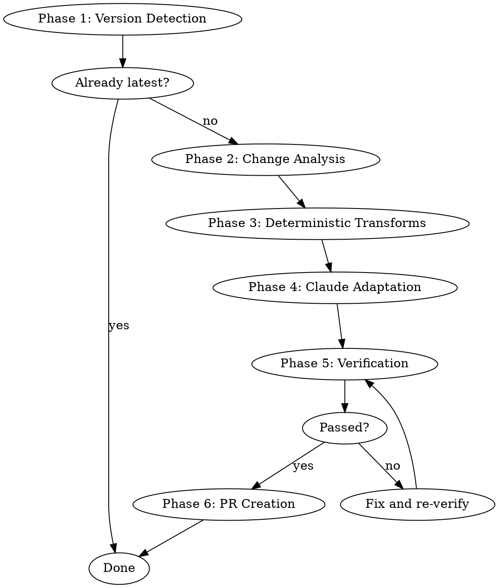

# lmcache-sync Skill Implementation Plan

> **For agentic workers:** REQUIRED SUB-SKILL: Use superpowers:subagent-driven-development (recommended) or superpowers:executing-plans to implement this plan task-by-task. Steps use checkbox (`- [ ]`) syntax for tracking.

**Goal:** Build a native Claude Code skill that monitors LMCache upstream releases and auto-generates adaptation PRs for LMCache-Ascend.

**Architecture:** Skill (SKILL.md) orchestrates 6-phase pipeline. Three Python helper scripts handle mechanical operations (diff classification, deterministic transforms, verification). Claude Code itself handles code adaptation (Phase 4) and PR creation (Phase 6), replacing the previous external LLM API calls.

**Tech Stack:** Claude Code skill system, Python 3.10+ (stdlib + pyyaml), git, gh CLI

---

## File Structure

```
lmcache-ascend-sync/
├── skills/
│   └── lmcache-sync/
│       └── SKILL.md                    # [CREATE] Main skill file
├── scripts/
│   ├── classify_changes.py             # [CREATE] Change classification CLI
│   ├── apply_transforms.py             # [CREATE] Deterministic transforms CLI
│   └── verify_changes.py               # [CREATE] Verification CLI
├── tests/
│   ├── fixtures/                        # [CREATE] Test fixtures
│   │   ├── sample_diff.txt
│   │   ├── sample_ascend_init.py
│   │   └── sample_npu_connectors.py
│   ├── test_classify_changes.py         # [CREATE]
│   ├── test_apply_transforms.py         # [CREATE]
│   └── test_verify_changes.py           # [CREATE]
├── config/
│   ├── patch_points.yaml                # [EXISTING] No changes
│   └── transform_rules.yaml             # [EXISTING] No changes
└── src/                                 # [EXISTING] Reference only, no changes
```

---

### Task 1: verify_changes.py — Tier 1 Static Verification

**Files:**
- Create: `scripts/verify_changes.py`
- Create: `tests/test_verify_changes.py`
- Create: `tests/fixtures/sample_ascend_init.py`
- Reference: `src/verifier.py` (refactor source)

- [ ] **Step 1: Create test fixture — sample Ascend __init__.py**

Create `tests/fixtures/sample_ascend_init.py` with a minimal but realistic Ascend init file containing `LMCACHE_UPSTREAM_TAG`, `_CONFIG_DEFINITIONS`, Ascend-specific imports (`torch.npu`, `lmc_ops`), and at least one class with public methods.

```python
# SPDX-License-Identifier: Apache-2.0
import sys
import torch
import torch_npu  # noqa: F401

LMCACHE_UPSTREAM_TAG = "v0.4.3"

# Ascend-specific
from lmcache_ascend import lmc_ops  # noqa: F401

NUMA_ENABLED = True
is_310p = False


class AscendConfig:
    """Ascend-specific configuration."""

    def __init__(self):
        self.device = "npu"

    def get_device(self):
        return self.device

    def check_npu_available(self):
        return torch.npu.is_available()


_CONFIG_DEFINITIONS = {
    "local_disk_path_sharding": {"type": str, "default": "by_gpu"},
    "pd_skip_proxy_notification": {"type": bool, "default": False},
}
```

- [ ] **Step 2: Write failing test for verify_changes.py**

Create `tests/test_verify_changes.py`:

```python
"""Tests for scripts/verify_changes.py CLI."""
import json
import subprocess
import sys
from pathlib import Path

FIXTURES = Path(__file__).parent / "fixtures"


def run_verify(original_dir: str, modified_dir: str) -> dict:
    """Run verify_changes.py and return parsed JSON output."""
    result = subprocess.run(
        [
            sys.executable,
            "scripts/verify_changes.py",
            "--original", original_dir,
            "--modified", modified_dir,
        ],
        capture_output=True,
        text=True,
        cwd=Path(__file__).parent.parent,
    )
    return json.loads(result.stdout)


def test_identical_files_pass():
    """Identical original and modified files should pass all checks."""
    report = run_verify(str(FIXTURES), str(FIXTURES))
    assert report["passed"] is True


def test_syntax_error_fails():
    """Modified file with syntax error should fail."""
    import tempfile
    with tempfile.TemporaryDirectory() as tmpdir:
        mod_dir = Path(tmpdir) / "modified"
        mod_dir.mkdir()
        (mod_dir / "sample_ascend_init.py").write_text("def broken(\n")
        report = run_verify(str(FIXTURES), str(mod_dir))
        assert report["passed"] is False
        syntax_checks = [
            c for fv in report["results"]
            for c in fv["checks"] if c["name"] == "syntax"
        ]
        assert any(c["status"] == "FAILED" for c in syntax_checks)


def test_mass_deletion_fails():
    """Removing >30% lines should fail line_count check."""
    import tempfile
    with tempfile.TemporaryDirectory() as tmpdir:
        mod_dir = Path(tmpdir) / "modified"
        mod_dir.mkdir()
        # Keep only first 5 lines — way less than 70% of fixture
        original = (FIXTURES / "sample_ascend_init.py").read_text()
        reduced = "\n".join(original.split("\n")[:5])
        (mod_dir / "sample_ascend_init.py").write_text(reduced)
        report = run_verify(str(FIXTURES), str(mod_dir))
        assert report["passed"] is False


def test_lost_ascend_keyword_fails():
    """Removing Ascend keywords should fail ascend_keywords check."""
    import tempfile
    with tempfile.TemporaryDirectory() as tmpdir:
        mod_dir = Path(tmpdir) / "modified"
        mod_dir.mkdir()
        original = (FIXTURES / "sample_ascend_init.py").read_text()
        # Remove all torch.npu references
        modified = original.replace("torch.npu", "torch.cuda")
        (mod_dir / "sample_ascend_init.py").write_text(modified)
        report = run_verify(str(FIXTURES), str(mod_dir))
        keyword_checks = [
            c for fv in report["results"]
            for c in fv["checks"] if c["name"] == "ascend_keywords"
        ]
        assert any(c["status"] == "FAILED" for c in keyword_checks)
```

- [ ] **Step 3: Run tests to verify they fail**

Run: `cd /Users/hexiaoying/cc_workspace/lmcache-ascend-sync && python -m pytest tests/test_verify_changes.py -v`
Expected: FAIL — `scripts/verify_changes.py` does not exist yet.

- [ ] **Step 4: Implement verify_changes.py**

Create `scripts/verify_changes.py` — a standalone CLI that compares original vs modified Python source files and outputs a JSON verification report. Refactored from `src/verifier.py` but:
- No dependency on any `src/` module
- Reads files from two directories (original/ and modified/)
- Outputs JSON to stdout
- Accepts `--original` and `--modified` directory arguments

```python
#!/usr/bin/env python3
"""verify_changes.py — Tier 1 static verification for LMCache-Ascend adaptations.

Compares original and modified Python source files, checking:
- P0: Syntax validity (ast.parse)
- P0: Line count delta (<30% threshold)
- P0: Class preservation (all original classes still exist)
- P0: Ascend keyword preservation (torch.npu, lmc_ops, etc.)
- P1: Public method preservation
- P1: Import structure preservation

Usage:
    python scripts/verify_changes.py --original <dir> --modified <dir>
"""

import argparse
import ast
import json
import sys
from dataclasses import dataclass, field
from pathlib import Path

ASCEND_KEYWORDS = [
    "torch.npu", "lmc_ops", "is_310p", "Ascend", "npu.",
    "NPU", "CANN", "AscendLMCacheEngine", "NPUConnector", "npu_connector",
]


@dataclass
class CheckResult:
    name: str
    status: str  # "passed", "FAILED", "WARNING"
    message: str

    def to_dict(self):
        return {"name": self.name, "status": self.status, "message": self.message}


@dataclass
class FileVerification:
    filepath: str
    checks: list = field(default_factory=list)
    passed: bool = True

    def to_dict(self):
        return {
            "filepath": self.filepath,
            "passed": self.passed,
            "checks": [c.to_dict() for c in self.checks],
        }


def check_syntax(filepath: str, code: str) -> CheckResult:
    if not code.strip():
        return CheckResult("syntax", "FAILED", "Empty file")
    try:
        ast.parse(code, filename=filepath)
        return CheckResult("syntax", "passed", "Valid Python syntax")
    except SyntaxError as e:
        return CheckResult("syntax", "FAILED", f"Syntax error at line {e.lineno}: {e.msg}")


def check_line_count(filepath: str, original: str, modified: str,
                     max_pct: float = 30.0) -> CheckResult:
    orig_n = len(original.strip().split("\n"))
    new_n = len(modified.strip().split("\n"))
    if orig_n == 0:
        return CheckResult("line_count", "passed", "Original was empty")
    delta = abs(new_n - orig_n) / orig_n * 100
    if delta > max_pct:
        direction = "+" if new_n > orig_n else "-"
        return CheckResult(
            "line_count", "FAILED",
            f"{direction}{delta:.0f}% lines ({orig_n}->{new_n}), threshold {max_pct}%",
        )
    return CheckResult("line_count", "passed", f"{delta:.1f}% delta ({orig_n}->{new_n})")


def get_class_names(source: str) -> set:
    try:
        return {n.name for n in ast.walk(ast.parse(source)) if isinstance(n, ast.ClassDef)}
    except SyntaxError:
        return set()


def get_public_methods(source: str) -> set:
    methods = set()
    try:
        tree = ast.parse(source)
        for node in ast.walk(tree):
            if isinstance(node, ast.ClassDef):
                for item in node.body:
                    if isinstance(item, (ast.FunctionDef, ast.AsyncFunctionDef)):
                        if not item.name.startswith("_"):
                            methods.add(f"{node.name}.{item.name}")
    except SyntaxError:
        pass
    return methods


def get_imports(source: str) -> set:
    imports = set()
    try:
        tree = ast.parse(source)
        for node in ast.walk(tree):
            if isinstance(node, ast.Import):
                for alias in node.names:
                    imports.add(f"import {alias.name}")
            elif isinstance(node, ast.ImportFrom):
                module = node.module or ""
                names = ", ".join(a.name for a in node.names)
                imports.add(f"from {module} import {names}")
    except SyntaxError:
        pass
    return imports


def check_class_preservation(filepath: str, original: str, modified: str) -> CheckResult:
    orig = get_class_names(original)
    new = get_class_names(modified)
    missing = orig - new
    if missing:
        return CheckResult("class_preservation", "FAILED", f"Missing classes: {', '.join(sorted(missing))}")
    return CheckResult("class_preservation", "passed", f"All {len(orig)} classes preserved")


def check_method_preservation(filepath: str, original: str, modified: str) -> CheckResult:
    orig = get_public_methods(original)
    new = get_public_methods(modified)
    missing = orig - new
    if missing:
        return CheckResult("method_preservation", "FAILED", f"Missing methods: {', '.join(sorted(missing))}")
    return CheckResult("method_preservation", "passed", f"All {len(orig)} public methods preserved")


def check_import_preservation(filepath: str, original: str, modified: str) -> CheckResult:
    orig = get_imports(original)
    new = get_imports(modified)
    missing = orig - new
    if missing:
        return CheckResult("import_preservation", "WARNING", f"Missing imports: {', '.join(sorted(missing))}")
    return CheckResult("import_preservation", "passed", "All imports preserved")


def check_ascend_keywords(filepath: str, original: str, modified: str) -> CheckResult:
    lost = []
    for kw in ASCEND_KEYWORDS:
        orig_count = original.count(kw)
        new_count = modified.count(kw)
        if orig_count > 0 and new_count < orig_count:
            lost.append(f"{kw} ({orig_count}->{new_count})")
    if lost:
        return CheckResult("ascend_keywords", "FAILED", f"Lost Ascend keywords: {', '.join(lost)}")
    return CheckResult("ascend_keywords", "passed", "Ascend keywords preserved")


def verify_file(filepath: str, original: str, modified: str) -> FileVerification:
    checks = [check_syntax(filepath, modified)]
    if original:
        checks.append(check_line_count(filepath, original, modified))
        checks.append(check_class_preservation(filepath, original, modified))
        checks.append(check_method_preservation(filepath, original, modified))
        checks.append(check_import_preservation(filepath, original, modified))
        checks.append(check_ascend_keywords(filepath, original, modified))
    else:
        for name in ["line_count", "class_preservation", "method_preservation",
                      "import_preservation", "ascend_keywords"]:
            checks.append(CheckResult(name, "passed", "New file"))

    passed = all(c.status != "FAILED" for c in checks)
    return FileVerification(filepath=filepath, checks=checks, passed=passed)


def main():
    parser = argparse.ArgumentParser(description="Verify LMCache-Ascend adaptation changes")
    parser.add_argument("--original", required=True, help="Directory with original files")
    parser.add_argument("--modified", required=True, help="Directory with modified files")
    args = parser.parse_args()

    original_dir = Path(args.original)
    modified_dir = Path(args.modified)

    results = []
    all_passed = True

    for py_file in sorted(modified_dir.glob("**/*.py")):
        rel = py_file.relative_to(modified_dir)
        orig_path = original_dir / rel
        original = orig_path.read_text() if orig_path.exists() else ""
        modified = py_file.read_text()
        fv = verify_file(str(rel), original, modified)
        results.append(fv)
        if not fv.passed:
            all_passed = False

    report = {
        "passed": all_passed,
        "results": [fv.to_dict() for fv in results],
    }
    print(json.dumps(report, indent=2))
    sys.exit(0 if all_passed else 1)


if __name__ == "__main__":
    main()
```

- [ ] **Step 5: Run tests to verify they pass**

Run: `cd /Users/hexiaoying/cc_workspace/lmcache-ascend-sync && python -m pytest tests/test_verify_changes.py -v`
Expected: All 4 tests PASS.

- [ ] **Step 6: Commit**

```bash
git add scripts/verify_changes.py tests/test_verify_changes.py tests/fixtures/sample_ascend_init.py
git commit -m "feat: add verify_changes.py — Tier 1 static verification CLI"
```

---

### Task 2: classify_changes.py — Diff Classification

**Files:**
- Create: `scripts/classify_changes.py`
- Create: `tests/test_classify_changes.py`
- Create: `tests/fixtures/sample_diff.txt`
- Reference: `src/change_classifier.py` (refactor source)

- [ ] **Step 1: Create test fixture — sample unified diff**

Create `tests/fixtures/sample_diff.txt` with a realistic diff excerpt from the v0.4.3→v0.4.4 changes:

```
diff --git a/lmcache/v1/gpu_connector/gpu_connectors.py b/lmcache/v1/gpu_connector/gpu_connectors.py
--- a/lmcache/v1/gpu_connector/gpu_connectors.py
+++ b/lmcache/v1/gpu_connector/gpu_connectors.py
@@ -500,7 +500,7 @@ class VLLMPagedMemGPUConnectorV2:
-        if self.is_tuple_format():
+        if self.is_separate_format():
             return

@@ -559,7 +559,7 @@ class VLLMPagedMemGPUConnectorV2:
-        if self.is_tuple_format():
+        if self.is_separate_format():
             return

@@ -1,3 +1,5 @@
+from lmcache.v1.memory_format import MemoryFormat, KV_MLA_FMT
+from typing import Optional

diff --git a/lmcache/v1/config.py b/lmcache/v1/config.py
--- a/lmcache/v1/config.py
+++ b/lmcache/v1/config.py
@@ -85,6 +85,14 @@
+    "local_disk_path_sharding": {"type": str, "default": "by_gpu"},
+    "pd_skip_proxy_notification": {"type": bool, "default": False},
+    "use_gds": {"type": bool, "default": False},
+    "gds_backend": {"type": str, "default": "cufile"},

diff --git a/lmcache/v1/cache_engine.py b/lmcache/v1/cache_engine.py
--- a/lmcache/v1/cache_engine.py
+++ b/lmcache/v1/cache_engine.py
@@ -120,8 +120,10 @@ def retrieve(self, fmt, **kwargs):
-        return self._storage_backend.get(key)
+        result = self._storage_backend.get(key)
+        if result is None:
+            raise ValueError(f"Key not found: {key}")
+        return result
```

- [ ] **Step 2: Write failing test for classify_changes.py**

Create `tests/test_classify_changes.py`:

```python
"""Tests for scripts/classify_changes.py CLI."""
import json
import subprocess
import sys
from pathlib import Path

FIXTURES = Path(__file__).parent / "fixtures"
ROOT = Path(__file__).parent.parent


def run_classify(diff_file: str, patch_points: str) -> dict:
    result = subprocess.run(
        [
            sys.executable,
            str(ROOT / "scripts" / "classify_changes.py"),
            "--diff", diff_file,
            "--patch-points", patch_points,
        ],
        capture_output=True,
        text=True,
    )
    return json.loads(result.stdout)


def test_classify_identifies_rename():
    """Mechanical rename (is_tuple_format -> is_separate_format) should be classified."""
    report = run_classify(
        str(FIXTURES / "sample_diff.txt"),
        str(ROOT / "config" / "patch_points.yaml"),
    )
    hunks = report["hunks"]
    rename_hunks = [h for h in hunks if h["change_type"] == "mechanical_rename"]
    assert len(rename_hunks) >= 1, f"Expected at least 1 rename, got: {[h['change_type'] for h in hunks]}"


def test_classify_identifies_import_change():
    """New import lines should be classified as import_change."""
    report = run_classify(
        str(FIXTURES / "sample_diff.txt"),
        str(ROOT / "config" / "patch_points.yaml"),
    )
    hunks = report["hunks"]
    import_hunks = [h for h in hunks if h["change_type"] == "import_change"]
    assert len(import_hunks) >= 1, f"Expected import_change, got types: {[h['change_type'] for h in hunks]}"


def test_classify_identifies_config_addition():
    """Config field additions should be classified as config_addition."""
    report = run_classify(
        str(FIXTURES / "sample_diff.txt"),
        str(ROOT / "config" / "patch_points.yaml"),
    )
    hunks = report["hunks"]
    config_hunks = [h for h in hunks if h["change_type"] == "config_addition"]
    assert len(config_hunks) >= 1, f"Expected config_addition, got types: {[h['change_type'] for h in hunks]}"


def test_classify_identifies_logic_change():
    """Non-trivial code changes should be classified as logic_change."""
    report = run_classify(
        str(FIXTURES / "sample_diff.txt"),
        str(ROOT / "config" / "patch_points.yaml"),
    )
    hunks = report["hunks"]
    logic_hunks = [h for h in hunks if h["change_type"] == "logic_change"]
    assert len(logic_hunks) >= 1, f"Expected logic_change, got types: {[h['change_type'] for h in hunks]}"


def test_classify_maps_ascend_files():
    """Each relevant hunk should have ascend_files mapping."""
    report = run_classify(
        str(FIXTURES / "sample_diff.txt"),
        str(ROOT / "config" / "patch_points.yaml"),
    )
    relevant = [h for h in report["hunks"] if h["change_type"] != "irrelevant"]
    for hunk in relevant:
        assert len(hunk["ascend_files"]) > 0, f"Hunk in {hunk['file_path']} has no ascend_files"


def test_classify_output_is_valid_json():
    """Output should be valid JSON with expected top-level keys."""
    report = run_classify(
        str(FIXTURES / "sample_diff.txt"),
        str(ROOT / "config" / "patch_points.yaml"),
    )
    assert "hunks" in report
    assert "total" in report
    assert "relevant" in report
```

- [ ] **Step 3: Run tests to verify they fail**

Run: `cd /Users/hexiaoying/cc_workspace/lmcache-ascend-sync && python -m pytest tests/test_classify_changes.py -v`
Expected: FAIL — `scripts/classify_changes.py` does not exist.

- [ ] **Step 4: Implement classify_changes.py**

Create `scripts/classify_changes.py` — refactored from `src/change_classifier.py`. Key differences from original:
- Standalone CLI with argparse
- Builds relevance map dynamically from `patch_points.yaml` (not hardcoded)
- Outputs JSON to stdout (not Python objects)
- No dependency on `src/` modules

```python
#!/usr/bin/env python3
"""classify_changes.py — Classify upstream diff hunks by change type.

Parses a unified diff, classifies each hunk as one of:
  mechanical_rename, import_change, config_addition, param_change,
  logic_change, new_method, new_class, irrelevant

Usage:
    python scripts/classify_changes.py --diff <diff_file> --patch-points <yaml>
"""

import argparse
import json
import re
import sys
from pathlib import Path

import yaml


def parse_diff(diff_text: str) -> list[dict]:
    """Parse unified diff into hunk dicts."""
    hunks = []
    current_file = ""
    current_lines = []

    for line in diff_text.split("\n"):
        file_match = re.match(r'^\+\+\+ b/(.+)$', line)
        if file_match:
            current_file = file_match.group(1)
            continue
        hunk_match = re.match(r'^@@ -(\d+)(?:,\d+)? \+(\d+)(?:,\d+)? @@', line)
        if hunk_match:
            if current_lines:
                hunks.append(_build_hunk(current_file, current_lines))
            current_lines = [line]
            continue
        if current_lines:
            current_lines.append(line)

    if current_lines:
        hunks.append(_build_hunk(current_file, current_lines))
    return hunks


def _build_hunk(file_path: str, lines: list[str]) -> dict:
    header = lines[0] if lines else ""
    old_lines, new_lines, context = [], [], []
    for line in lines[1:]:
        if line.startswith("-"):
            old_lines.append(line[1:])
        elif line.startswith("+"):
            new_lines.append(line[1:])
        elif line.startswith(" "):
            context.append(line[1:])

    m = re.match(r'^@@ -(\d+)(?:,\d+)? \+(\d+)(?:,\d+)? @@', header)
    return {
        "file_path": file_path,
        "old_start": int(m.group(1)) if m else 0,
        "new_start": int(m.group(2)) if m else 0,
        "old_lines": old_lines,
        "new_lines": new_lines,
        "context_lines": context,
    }


def build_relevance_map(patch_points: list[dict]) -> dict[str, list[str]]:
    """Build upstream-module -> [ascend_files] mapping from patch_points.yaml."""
    mapping = {}
    for pp in patch_points:
        module = pp.get("module", "")
        ascend = pp.get("ascend_file", "")
        if module and ascend:
            # Normalize module to file path
            if not module.endswith(".py") and not module.endswith("/"):
                module = module.replace(".", "/") + ".py"
            mapping.setdefault(module, [])
            if ascend not in mapping[module]:
                mapping[module].append(ascend)
    return mapping


def is_relevant(file_path: str, relevance_map: dict) -> bool:
    for module in relevance_map:
        if file_path.startswith(module) or file_path == module:
            return True
    return False


def classify_hunk(hunk: dict, relevance_map: dict) -> dict:
    """Classify a single hunk. Returns dict with change_type, confidence, description, ascend_files."""
    file_path = hunk["file_path"]

    if not is_relevant(file_path, relevance_map):
        return {
            "change_type": "irrelevant",
            "confidence": 1.0,
            "description": f"Irrelevant file: {file_path}",
            "ascend_files": [],
        }

    ascend_files = []
    for module, files in relevance_map.items():
        if file_path.startswith(module) or file_path == module:
            ascend_files.extend(files)
    if not ascend_files:
        ascend_files = ["lmcache_ascend/__init__.py"]

    # Heuristic 1: import-only
    all_lines = hunk["old_lines"] + hunk["new_lines"]
    if all_lines and all(l.strip().startswith(("import ", "from ")) for l in all_lines):
        return {
            "change_type": "import_change",
            "confidence": 0.9,
            "description": f"Import change in {file_path}",
            "ascend_files": ascend_files,
        }

    # Heuristic 2: mechanical rename
    if _is_mechanical_rename(hunk):
        desc = _describe_rename(hunk)
        return {
            "change_type": "mechanical_rename",
            "confidence": 0.85,
            "description": f"Rename in {file_path}: {desc}",
            "ascend_files": ascend_files,
        }

    # Heuristic 3: config addition
    if _is_config_addition(hunk):
        return {
            "change_type": "config_addition",
            "confidence": 0.9,
            "description": f"Config addition in {file_path}",
            "ascend_files": ascend_files,
        }

    # Heuristic 4: new definition
    new_name = _get_new_definition_name(hunk)
    if new_name:
        ct = "new_class" if new_name[0].isupper() else "new_method"
        return {
            "change_type": ct,
            "confidence": 0.8,
            "description": f"New {ct} in {file_path}: {new_name}",
            "ascend_files": ascend_files,
        }

    # Heuristic 5: param change
    if _is_param_change(hunk):
        return {
            "change_type": "param_change",
            "confidence": 0.7,
            "description": f"Parameter change in {file_path}",
            "ascend_files": ascend_files,
        }

    # Default: logic change
    return {
        "change_type": "logic_change",
        "confidence": 0.5,
        "description": f"Logic change in {file_path} (lines {hunk['old_start']}->{hunk['new_start']})",
        "ascend_files": ascend_files,
    }


def _is_mechanical_rename(hunk: dict) -> bool:
    if len(hunk["old_lines"]) != len(hunk["new_lines"]):
        return False
    if not hunk["old_lines"]:
        return False
    has_diff = False
    for old, new in zip(hunk["old_lines"], hunk["new_lines"]):
        os, ns = old.strip(), new.strip()
        if os == ns:
            continue
        has_diff = True
        if len(os) == len(ns):
            diffs = sum(1 for a, b in zip(os, ns) if a != b)
            if diffs / max(len(os), 1) < 0.3:
                continue
        else:
            continue
    return has_diff


def _describe_rename(hunk: dict) -> str:
    for old, new in zip(hunk["old_lines"], hunk["new_lines"]):
        os, ns = old.strip(), new.strip()
        if os != ns:
            return f"{os} -> {new.strip()}"
    return ""


def _is_config_addition(hunk: dict) -> bool:
    if not hunk["new_lines"]:
        return False
    if "config" in hunk["file_path"]:
        new_text = "\n".join(hunk["new_lines"])
        if re.search(r'["\']\w+["\']\s*:', new_text):
            return True
    return False


def _get_new_definition_name(hunk: dict) -> str:
    for line in hunk["new_lines"]:
        s = line.strip()
        if s.startswith("def "):
            m = re.match(r'def\s+(\w+)', s)
            if m:
                # Check it's truly new
                if not any(ol.strip() == s for ol in hunk["old_lines"]):
                    return m.group(1)
        elif s.startswith("class "):
            m = re.match(r'class\s+(\w+)', s)
            if m:
                if not any(ol.strip() == s for ol in hunk["old_lines"]):
                    return m.group(1)
    return ""


def _is_param_change(hunk: dict) -> bool:
    old_defs = [l.strip() for l in hunk["old_lines"] if l.strip().startswith("def ")]
    new_defs = [l.strip() for l in hunk["new_lines"] if l.strip().startswith("def ")]
    if old_defs and new_defs:
        for od, nd in zip(old_defs, new_defs):
            on = re.match(r'def\s+(\w+)', od)
            nn = re.match(r'def\s+(\w+)', nd)
            if on and nn and on.group(1) == nn.group(1):
                return True
    return False


def main():
    parser = argparse.ArgumentParser(description="Classify upstream diff hunks")
    parser.add_argument("--diff", required=True, help="Path to unified diff file")
    parser.add_argument("--patch-points", required=True, help="Path to patch_points.yaml")
    args = parser.parse_args()

    diff_text = Path(args.diff).read_text()
    with open(args.patch_points) as f:
        pp_data = yaml.safe_load(f)
    patch_points = pp_data.get("patch_points", [])
    relevance_map = build_relevance_map(patch_points)

    hunks = parse_diff(diff_text)
    results = []
    for hunk in hunks:
        classification = classify_hunk(hunk, relevance_map)
        results.append({
            **classification,
            "file_path": hunk["file_path"],
            "old_start": hunk["old_start"],
            "new_start": hunk["new_start"],
            "old_lines": hunk["old_lines"],
            "new_lines": hunk["new_lines"],
        })

    relevant = [r for r in results if r["change_type"] != "irrelevant"]
    report = {
        "total": len(results),
        "relevant": len(relevant),
        "hunks": results,
    }
    print(json.dumps(report, indent=2))


if __name__ == "__main__":
    main()
```

- [ ] **Step 5: Run tests to verify they pass**

Run: `cd /Users/hexiaoying/cc_workspace/lmcache-ascend-sync && python -m pytest tests/test_classify_changes.py -v`
Expected: All 6 tests PASS.

- [ ] **Step 6: Commit**

```bash
git add scripts/classify_changes.py tests/test_classify_changes.py tests/fixtures/sample_diff.txt
git commit -m "feat: add classify_changes.py — diff classification CLI"
```

---

### Task 3: apply_transforms.py — Deterministic Transforms

**Files:**
- Create: `scripts/apply_transforms.py`
- Create: `tests/test_apply_transforms.py`
- Create: `tests/fixtures/sample_npu_connectors.py`
- Reference: `src/deterministic_transform.py` (refactor source), `config/transform_rules.yaml`

- [ ] **Step 1: Create test fixture — sample NPU connector file**

Create `tests/fixtures/sample_npu_connectors.py` with a minimal NPU connector containing patterns that transform rules target:

```python
"""Sample NPU connector for testing transforms."""
import torch


class VLLMPagedMemNPUConnectorV2:
    def __init__(self):
        self.device = torch.npu.current_device()

    def _initialize_pointers(self):
        if self.is_tuple_format():
            return
        if torch.npu.is_available():
            import lmcache.c_ops  # noqa

    def transfer_to_npu(self):
        if self.is_tuple_format():
            return
        buf = self._alloc_buffer(MemoryFormat.KV_T2D)
        return buf

    def transfer_from_npu(self):
        if self.is_tuple_format():
            return
        buf = self._alloc_buffer(MemoryFormat.KV_T2D)
        return buf

    def is_tuple_format(self):
        return True
```

- [ ] **Step 2: Write failing test for apply_transforms.py**

Create `tests/test_apply_transforms.py`:

```python
"""Tests for scripts/apply_transforms.py CLI."""
import json
import subprocess
import sys
import tempfile
from pathlib import Path

FIXTURES = Path(__file__).parent / "fixtures"
ROOT = Path(__file__).parent.parent


def run_transforms(source_dir: str, rules: str) -> dict:
    result = subprocess.run(
        [
            sys.executable,
            str(ROOT / "scripts" / "apply_transforms.py"),
            "--source-dir", source_dir,
            "--rules", rules,
        ],
        capture_output=True,
        text=True,
    )
    return json.loads(result.stdout)


def test_rename_transform():
    """is_tuple_format should be renamed to is_separate_format."""
    with tempfile.TemporaryDirectory() as tmpdir:
        src = Path(tmpdir) / "lmcache_ascend/v1/npu_connector"
        src.mkdir(parents=True)
        fixture = FIXTURES / "sample_npu_connectors.py"
        target = src / "npu_connectors.py"
        target.write_text(fixture.read_text())

        report = run_transforms(tmpdir, str(ROOT / "config" / "transform_rules.yaml"))

        modified = target.read_text()
        assert "is_separate_format" in modified, "is_tuple_format should be renamed"
        assert "is_tuple_format" not in modified.replace("def is_tuple_format", ""), \
            "is_tuple_format references should be renamed (except the method definition itself)"


def test_transform_outputs_json_summary():
    """Output should be valid JSON with files_modified count."""
    with tempfile.TemporaryDirectory() as tmpdir:
        src = Path(tmpdir) / "lmcache_ascend/v1/npu_connector"
        src.mkdir(parents=True)
        (src / "npu_connectors.py").write_text(
            (FIXTURES / "sample_npu_connectors.py").read_text()
        )

        report = run_transforms(tmpdir, str(ROOT / "config" / "transform_rules.yaml"))
        assert "files_modified" in report
        assert isinstance(report["files_modified"], int)


def test_no_match_returns_zero():
    """Files with no matching patterns should report 0 modifications."""
    with tempfile.TemporaryDirectory() as tmpdir:
        src = Path(tmpdir) / "lmcache_ascend/v1/npu_connector"
        src.mkdir(parents=True)
        (src / "npu_connectors.py").write_text("# empty file\npass\n")

        report = run_transforms(tmpdir, str(ROOT / "config" / "transform_rules.yaml"))
        assert report["files_modified"] == 0
```

- [ ] **Step 3: Run tests to verify they fail**

Run: `cd /Users/hexiaoying/cc_workspace/lmcache-ascend-sync && python -m pytest tests/test_apply_transforms.py -v`
Expected: FAIL — `scripts/apply_transforms.py` does not exist.

- [ ] **Step 4: Implement apply_transforms.py**

Create `scripts/apply_transforms.py` — refactored from `src/deterministic_transform.py`. Key differences:
- Standalone CLI, reads source files from directory
- Applies rules from YAML, modifies files in-place
- Outputs JSON summary to stdout
- No dependency on `src/` modules

```python
#!/usr/bin/env python3
"""apply_transforms.py — Apply deterministic code transforms.

Applies rules from transform_rules.yaml to source files in-place.

Usage:
    python scripts/apply_transforms.py --source-dir <dir> --rules <yaml>
"""

import argparse
import json
import re
import sys
from pathlib import Path

import yaml


def load_rules(rules_path: str) -> list[dict]:
    with open(rules_path) as f:
        data = yaml.safe_load(f)
    return data.get("rules", [])


def get_target_files(rule: dict, sources: dict[str, str]) -> list[str]:
    if rule.get("files"):
        return [f for f in rule["files"] if f in sources]
    if rule.get("target_file"):
        return [rule["target_file"]] if rule["target_file"] in sources else []
    return list(sources.keys())


def apply_replace(rule: dict, sources: dict[str, str]) -> dict[str, str]:
    results = {}
    for fp in get_target_files(rule, sources):
        s = sources[fp]
        if rule["pattern"] not in s:
            continue
        new_s = s.replace(rule["pattern"], rule["replacement"])
        if new_s != s:
            results[fp] = new_s
    return results


def apply_rename(rule: dict, sources: dict[str, str]) -> dict[str, str]:
    results = {}
    pat = re.compile(r'\b' + re.escape(rule["pattern"]) + r'\b')
    for fp in get_target_files(rule, sources):
        s = sources[fp]
        if not pat.search(s):
            continue
        new_s = pat.sub(rule["replacement"], s)
        if new_s != s:
            results[fp] = new_s
    return results


def apply_import_unguard(rule: dict, sources: dict[str, str]) -> dict[str, str]:
    results = {}
    for fp in get_target_files(rule, sources):
        s = sources[fp]
        # Match: if torch.cuda/npu.is_available():\n    import ...
        guard_pat = re.compile(
            r'if\s+torch\.(cuda|npu)\.is_available\(\):\s*\n(\s+)'
            + re.escape(rule["replacement"].replace("import ", "")),
            re.MULTILINE,
        )
        m = guard_pat.search(s)
        if m:
            new_s = s[:m.start()] + rule["replacement"] + s[m.end():]
            results[fp] = new_s
            continue
        if rule.get("pattern") and rule["pattern"] in s:
            new_s = s.replace(rule["pattern"], rule["replacement"])
            if new_s != s:
                results[fp] = new_s
    return results


def apply_conditional_replace(rule: dict, sources: dict[str, str]) -> dict[str, str]:
    results = {}
    pat = re.compile(re.escape(rule["pattern"]))
    context = rule.get("context_within", "")

    for fp in get_target_files(rule, sources):
        s = sources[fp]
        if not pat.search(s):
            continue
        lines = s.split("\n")
        new_lines = []
        in_ctx = False
        for line in lines:
            if context and context in line:
                in_ctx = True
            elif context == "def " and line.strip().startswith("def "):
                in_ctx = True
            elif line.strip() and line[0] not in (' ', '\t') and not line.strip().startswith(
                ("if ", "for ", "while ", "with ", "else", "elif", "try", "except", "finally")
            ):
                in_ctx = False
            new_lines.append(pat.sub(rule["replacement"], line) if in_ctx else line)
        new_s = "\n".join(new_lines)
        if new_s != s:
            results[fp] = new_s
    return results


def apply_config_rename(rule: dict, sources: dict[str, str]) -> dict[str, str]:
    results = {}
    fp = rule.get("target_file", "")
    if fp not in sources:
        return results
    s = sources[fp]
    old_pat = re.compile(r'["\']' + re.escape(rule["old_field"]) + r'["\']')
    if old_pat.search(s):
        new_s = old_pat.sub(f'"{rule["new_field"]}"', s)
        ref_pat = re.compile(r'\b' + re.escape(rule["old_field"]) + r'\b')
        new_s = ref_pat.sub(rule["new_field"], new_s)
        if new_s != s:
            results[fp] = new_s
    return results


def apply_config_add(rule: dict, sources: dict[str, str]) -> dict[str, str]:
    results = {}
    fp = rule.get("target_file", "")
    if fp not in sources or not rule.get("fields"):
        return results
    s = sources[fp]
    for field_def in rule["fields"]:
        name = field_def["name"]
        if f'"{name}"' in s or f"'{name}'" in s:
            continue
        definition = field_def.get("definition", '{"type": str, "default": ""}')
        config_pat = re.compile(r'(_CONFIG_DEFINITIONS\s*=\s*\{.*?)(\n\s*\})', re.DOTALL)
        m = config_pat.search(s)
        if m:
            entry = f'\n    "{name}": {definition},'
            pos = m.end() - len(m.group(2))
            s = s[:pos] + entry + m.group(2)
    if s != sources[fp]:
        results[fp] = s
    return results


APPLY_MAP = {
    "replace": apply_replace,
    "rename": apply_rename,
    "import_unguard": apply_import_unguard,
    "conditional_replace": apply_conditional_replace,
    "config_rename": apply_config_rename,
    "config_add": apply_config_add,
}


def main():
    parser = argparse.ArgumentParser(description="Apply deterministic transforms")
    parser.add_argument("--source-dir", required=True, help="Root directory of source files")
    parser.add_argument("--rules", required=True, help="Path to transform_rules.yaml")
    args = parser.parse_args()

    source_dir = Path(args.source_dir)
    rules = load_rules(args.rules)

    # Read all Python files
    sources = {}
    for py_file in source_dir.glob("**/*.py"):
        rel = str(py_file.relative_to(source_dir))
        sources[rel] = py_file.read_text()

    working = dict(sources)
    modified = {}
    applied_rules = []

    for rule in rules:
        rule_type = rule.get("type", "")
        applier = APPLY_MAP.get(rule_type)
        if not applier:
            continue
        changed = applier(rule, working)
        if changed:
            working.update(changed)
            modified.update(changed)
            applied_rules.append(rule["name"])

    # Write modified files back
    for rel, content in modified.items():
        fp = source_dir / rel
        fp.parent.mkdir(parents=True, exist_ok=True)
        fp.write_text(content)

    report = {
        "files_modified": len(modified),
        "modified_files": list(modified.keys()),
        "rules_applied": applied_rules,
    }
    print(json.dumps(report, indent=2))


if __name__ == "__main__":
    main()
```

- [ ] **Step 5: Run tests to verify they pass**

Run: `cd /Users/hexiaoying/cc_workspace/lmcache-ascend-sync && python -m pytest tests/test_apply_transforms.py -v`
Expected: All 3 tests PASS.

- [ ] **Step 6: Commit**

```bash
git add scripts/apply_transforms.py tests/test_apply_transforms.py tests/fixtures/sample_npu_connectors.py
git commit -m "feat: add apply_transforms.py — deterministic transform CLI"
```

---

### Task 4: SKILL.md — Main Skill File

**Files:**
- Create: `skills/lmcache-sync/SKILL.md`

- [ ] **Step 1: Write SKILL.md**

Create `skills/lmcache-sync/SKILL.md` with complete skill definition. This is the core artifact — it tells Claude Code exactly how to execute the 6-phase pipeline.

```markdown
---
name: lmcache-sync
description: Use when monitoring LMCache upstream releases for LMCache-Ascend adaptation needs, checking upstream sync status, or generating adaptation PRs for new versions
---

# LMCache Upstream Sync

Monitor upstream LMCache releases and auto-generate adaptation PRs for LMCache-Ascend.

## When to Use

- User asks to "check upstream", "sync upstream", "check for new releases"
- User mentions "LMCache version", "upstream adaptation", "新版本适配"
- Scheduled daily check fires
- User invokes `/sync-lmcache`

## When NOT to Use

- Working on LMCache-Ascend features unrelated to upstream sync
- Simple rebase without code adaptation

## Configuration

| Key | Value |
|-----|-------|
| upstream_repo | `LMCache/LMCache` |
| downstream_repo | `LMCache/LMCache-Ascend` |
| fork_repo | `newpage1/LMCache-Ascend` |
| target_branch | `main` |
| version_source_file | `lmcache_ascend/__init__.py` |
| version_field | `LMCACHE_UPSTREAM_TAG` |
| sync_work_dir | `/tmp/lmcache-sync` |

## Pipeline



### Phase 1: Version Detection

1. Get current Ascend version:
   ```bash
   gh api repos/LMCache/LMCache-Ascend/contents/lmcache_ascend/__init__.py?ref=main
   ```
   Extract `LMCACHE_UPSTREAM_TAG` from the base64-decoded content. The value is quoted like `"v0.4.3"`.

2. Get latest upstream release:
   ```bash
   gh api repos/LMCache/LMCache/releases/latest --jq '.tag_name'
   ```

3. Compare. If `upstream_version == ascend_version`, report "Already up to date" and STOP.

### Phase 2: Change Analysis

1. Prepare upstream checkout:
   ```bash
   mkdir -p /tmp/lmcache-sync
   if [ -d /tmp/lmcache-sync/upstream ]; then
     cd /tmp/lmcache-sync/upstream && git fetch --tags
   else
     git clone https://github.com/LMCache/LMCache.git /tmp/lmcache-sync/upstream
   fi
   ```

2. Prepare downstream checkout (for reading current Ascend code):
   ```bash
   if [ -d /tmp/lmcache-sync/downstream ]; then
     cd /tmp/lmcache-sync/downstream && git pull
   else
     git clone https://github.com/LMCache/LMCache-Ascend.git /tmp/lmcache-sync/downstream
   fi
   ```

3. Get diff of watched files:
   ```bash
   cd /tmp/lmcache-sync/upstream
   git diff {ascend_version}..{upstream_version} -- \
     lmcache/v1/gpu_connector/ \
     lmcache/v1/cache_engine.py \
     lmcache/v1/config.py \
     lmcache/v1/memory_management.py \
     lmcache/v1/storage_backend/ \
     lmcache/c_ops \
     lmcache/v1/metadata.py \
     lmcache/v1/token_database.py \
     lmcache/v1/system_detection.py \
     lmcache/v1/rpc_utils.py \
     lmcache/v1/lookup_client/ \
     lmcache/v1/proxy_memory_obj.py \
     lmcache/v1/manager.py \
     lmcache/v1/transfer_channel/ \
     lmcache/v1/multiprocess/ \
     lmcache/integration/vllm/ \
     > /tmp/lmcache-sync/diff.txt
   ```

4. Classify changes:
   ```bash
   cd {project_root}
   python scripts/classify_changes.py \
     --diff /tmp/lmcache-sync/diff.txt \
     --patch-points config/patch_points.yaml \
     > /tmp/lmcache-sync/classifications.json
   ```

5. Read `classifications.json`. Separate into:
   - `mechanical_rename`, `import_change`, `config_addition` → Phase 3
   - `logic_change`, `param_change`, `new_method`, `new_class` → Phase 4
   - `irrelevant` → skip

### Phase 3: Deterministic Transforms

1. Copy downstream source for modification:
   ```bash
   cp -r /tmp/lmcache-sync/downstream /tmp/lmcache-sync/downstream_modified
   ```

2. Apply transform rules:
   ```bash
   cd {project_root}
   python scripts/apply_transforms.py \
     --source-dir /tmp/lmcache-sync/downstream_modified/lmcache_ascend \
     --rules config/transform_rules.yaml \
     > /tmp/lmcache-sync/transforms_summary.json
   ```

3. Read the summary. Note which files were modified by which rules.

### Phase 4: Claude Adaptation

For each hunk classified as `logic_change`, `param_change`, `new_method`, or `new_class`:

1. **Read upstream before version** of the affected method/class:
   ```bash
   cd /tmp/lmcache-sync/upstream
   git show {ascend_version}:{file_path}
   ```

2. **Read upstream after version**:
   ```bash
   git show {upstream_version}:{file_path}
   ```

3. **Read current Ascend version**:
   ```bash
   cat /tmp/lmcache-sync/downstream_modified/{ascend_file}
   ```

4. **Generate adaptation** by comparing upstream before/after, then applying the equivalent change to the Ascend version. Rules:
   - Keep ALL Ascend-specific logic: `torch.npu`, `lmc_ops`, `is_310p`, `NUMA`, `AscendLMCacheEngine`, `NPUConnector`
   - Only apply the equivalent of the upstream change
   - Preserve exact indentation
   - If the upstream change conflicts with Ascend-specific code, preserve the Ascend version and add a comment explaining the divergence

5. **Apply the change** using the Edit tool on the file in `/tmp/lmcache-sync/downstream_modified/`.

### Phase 5: Verification

1. **Tier 1 — Static analysis** (always run):
   ```bash
   cd {project_root}
   python scripts/verify_changes.py \
     --original /tmp/lmcache-sync/downstream/lmcache_ascend \
     --modified /tmp/lmcache-sync/downstream_modified/lmcache_ascend \
     > /tmp/lmcache-sync/verification.json
   ```

   Read the report. If `"passed": false`:
   - Review each FAILED check
   - Fix the issue in the modified file
   - Re-run verification
   - Repeat until all checks pass

2. **Tier 2 — Import check** (if Ascend environment available):
   ```bash
   cd /tmp/lmcache-sync/downstream_modified
   python -c "import ast; ast.parse(open('lmcache_ascend/__init__.py').read())"
   python -c "from lmcache_ascend.v1.npu_connector.npu_connectors import *"
   ```

   Detect environment: `python -c "import torch_npu"`. If unavailable, skip and note in PR.

3. **Tier 3 — Unit tests** (if NPU environment available):
   ```bash
   cd /tmp/lmcache-sync/downstream_modified
   pytest tests/v1/test_config.py tests/v1/test_npu_connector.py tests/v1/test_cache_engine.py tests/test_version_integrity.py -v
   ```

   If NPU environment unavailable, skip and note in PR body.

### Phase 6: PR Creation

1. Update version tag in modified source:
   ```bash
   # In /tmp/lmcache-sync/downstream_modified/lmcache_ascend/__init__.py
   # Replace LMCACHE_UPSTREAM_TAG = "v0.4.3" with LMCACHE_UPSTREAM_TAG = "{upstream_version}"
   ```

2. Clone fork and create branch:
   ```bash
   git clone https://github.com/newpage1/LMCache-Ascend.git /tmp/lmcache-sync/fork
   cd /tmp/lmcache-sync/fork
   git checkout -b sync/upstream-{upstream_version}
   ```

3. Copy modified files:
   ```bash
   cp -r /tmp/lmcache-sync/downstream_modified/lmcache_ascend/* /tmp/lmcache-sync/fork/lmcache_ascend/
   ```

4. Commit and push:
   ```bash
   cd /tmp/lmcache-sync/fork
   git add -A
   git commit -m "feat: adapt to upstream LMCache {upstream_version}

  Upstream changes: {list of key changes}
  Deterministic transforms applied: {list of rules}
  Claude-adapted changes: {list of logic changes}
  Verification: {tier 1 result summary}"
   git push origin sync/upstream-{upstream_version}
   ```

5. Create PR:
   ```bash
   gh pr create \
     --repo LMCache/LMCache-Ascend \
     --head newpage1:sync/upstream-{upstream_version} \
     --base main \
     --title "feat: adapt to upstream LMCache {upstream_version}" \
     --body "{PR body with change summary, verification results, and testing notes}"
   ```

## Error Handling

| Scenario | Action |
|----------|--------|
| No new release | Log "Already up to date" and exit |
| Clone failure | Retry once with `rm -rf` + fresh clone |
| Classify script fails | Treat ALL changes as `logic_change`, proceed to Phase 4 |
| Transform conflict | Skip conflicting rule, log warning |
| Verification fails | Fix issue and re-verify (max 3 attempts) |
| PR creation fails | Save changes to `/tmp/lmcache-sync/`, report error |
| Ascend env unavailable | Skip Tier 2/3, add note in PR body |

## Scheduled Check Setup

After skill is first used, set up daily monitoring:

```
CronCreate:
  cron: "23 6 * * *"
  prompt: "Check if LMCache upstream has a new release. If yes, run the full /sync-lmcache pipeline to generate an adaptation PR."
  recurring: true
  durable: true
```
```

- [ ] **Step 2: Validate SKILL.md loads correctly**

Manually verify the SKILL.md file:
- Frontmatter has `name` and `description` fields
- No TBD/TODO placeholders
- All code blocks use correct tool invocations
- Phase references are consistent (Phase 1-6)

- [ ] **Step 3: Commit**

```bash
git add skills/lmcache-sync/SKILL.md
git commit -m "feat: add lmcache-sync SKILL.md — native Claude Code skill"
```

---

### Task 5: End-to-End Integration Test

**Files:**
- No new files; validates existing scripts work together

- [ ] **Step 1: Run classify_changes.py against real v0.4.3→v0.4.4 diff**

```bash
cd /Users/hexiaoying/cc_workspace/lmcache-ascend-sync

# Prepare upstream repo
mkdir -p /tmp/lmcache-sync/e2e-test
if [ ! -d /tmp/lmcache-sync/e2e-test/upstream ]; then
  git clone https://github.com/LMCache/LMCache.git /tmp/lmcache-sync/e2e-test/upstream
fi
cd /tmp/lmcache-sync/e2e-test/upstream && git fetch --tags

# Generate diff
cd /tmp/lmcache-sync/e2e-test/upstream
git diff v0.4.3..v0.4.4 -- lmcache/v1/gpu_connector/ lmcache/v1/cache_engine.py lmcache/v1/config.py > /tmp/lmcache-sync/e2e-test/diff.txt

# Classify
cd /Users/hexiaoying/cc_workspace/lmcache-ascend-sync
python scripts/classify_changes.py \
  --diff /tmp/lmcache-sync/e2e-test/diff.txt \
  --patch-points config/patch_points.yaml
```

Expected: JSON output with classified hunks including `mechanical_rename` (is_tuple_format), `config_addition` (new fields), `import_change`, and `logic_change` (cache_engine retrieve fix).

- [ ] **Step 2: Run apply_transforms.py against sample Ascend files**

```bash
# Copy downstream for testing
cp -r /tmp/lmcache-sync/downstream/lmcache_ascend /tmp/lmcache-sync/e2e-test/ascend_copy

cd /Users/hexiaoying/cc_workspace/lmcache-ascend-sync
python scripts/apply_transforms.py \
  --source-dir /tmp/lmcache-sync/e2e-test/ascend_copy \
  --rules config/transform_rules.yaml
```

Expected: JSON summary showing files modified with is_tuple_format→is_separate_format rename, config field additions, etc.

- [ ] **Step 3: Run verify_changes.py on the transformed output**

```bash
cd /Users/hexiaoying/cc_workspace/lmcache-ascend-sync
python scripts/verify_changes.py \
  --original /tmp/lmcache-sync/downstream/lmcache_ascend \
  --modified /tmp/lmcache-sync/e2e-test/ascend_copy
```

Expected: `"passed": true` — transforms should not break any checks.

- [ ] **Step 4: Commit (if any test fixes were needed)**

```bash
git add -A
git commit -m "fix: address e2e test findings in helper scripts"
```

---

### Task 6: Cleanup — Remove Obsolete Code

**Files:**
- Remove: `state.json` reference in `.gitignore` (if exists)
- Document: `src/` is now reference-only

- [ ] **Step 1: Verify state.json is gone**

```bash
ls /Users/hexiaoying/cc_workspace/lmcache-ascend-sync/state.json
```
Expected: File not found. (Already removed in prior commit.)

- [ ] **Step 2: Add README note that src/ is reference-only**

Add a brief note at the top of `src/__init__.py` or in project root README:

```python
# NOTE: This directory contains the original pipeline implementation.
# The active implementation is now in scripts/ + skills/lmcache-sync/SKILL.md.
# This code is kept for reference only.
```

- [ ] **Step 3: Commit**

```bash
git add -A
git commit -m "chore: mark src/ as reference-only after skill migration"
```
